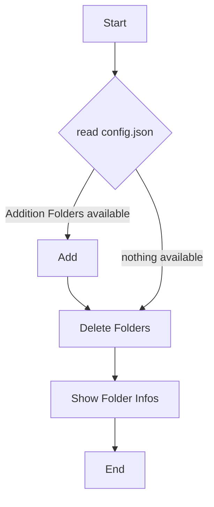

# DailyCleanUp

# Process 
By default, the following directories are deleted
- SystemDrive\Windows\Temp
- SystemDrive\Windows\Prefetch
- SystemDrive\Windows\Logs\CBS
- SystemDrive\Windows\SoftwareDistribution\Download\

